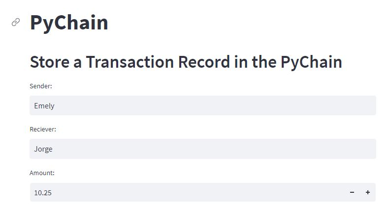
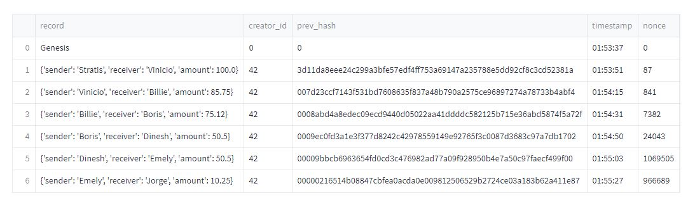
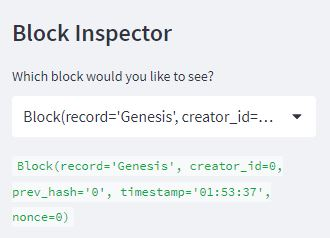
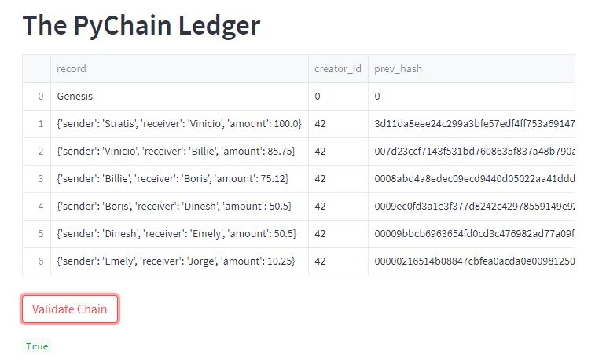

# Columbia Fintech Bootcamp: Module #18 Challenge

---

Feature Summary: To build a blockchain-based ledger system, with a user-friendly web interface. THe ledger allows partner banks to conduct financial transactions - that is, to transfer money between senders and receivers, and to verify the integrity of the data in the ledger.


- Includes the following tasks:

    - Create a Record Data Class
    - Modify the Existing Block Data Class to Store Record Data
    - Add Relevant User Inputs to the Streamlit Interface
    - Test the PyChain Ledger by Storing Records

---
## Technologies

This project leverages python 3.9 with the following packages:
- [pandas](https://pandas.pydata.org/) - Fast, powerful, flexible and easy to use open source data analysis and manipulation tool
- [streamlit](https://streamlit.io/) - Streamlit turns data scripts into shareable web apps.
- [dataclasses](https://docs.python.org/3/library/dataclasses.html) - Provides a decorator and functions for automatically adding generated special methods.
- [typing](https://docs.python.org/3/library/typing.html) - Provides runtime support for type hints.
- [datetime](https://docs.python.org/3/library/datetime.html) - Module supplies classes for manipulating dates and times.
- [hashlib](https://docs.python.org/3/library/hashlib.html) - Secure hashes and message digests.

This project leverages python 3.9 with the following packages:

Jupyter Lab 3.3.2 is required

- *Jupyter Lab is primarily used as a web-based development environment for the notebooks, code, and data associated with this project.  Its flexible interface allows users to configure and arrange workflows in data science*

---

## Installation Guide

Before running the application first install the following dependencies.

```python
  pip install streamlit
  pip install dataclasses
  pip install typing
  pip install datetime
  pip install pandas
  pip install hashlib

```
*Assumption made for module challenge: the* **sys** *and Path module will not be required to be explicitely called out in Installation guide section*

To run Jupyter Lab, need to install Anaconda:
- [Anaconda](https://docs.anaconda.com/anaconda/install/) - an open-source distribution of the Python
---

## Usage

To run the Machine Learning Trading Bot application, simply clone the repository and run the **streamlit run pychain.py** script in Jupyter Lab:

---

### Streamlit Web Application: PYCHAIN Transaction Inputs
                

---

### Streamlit Web Application: PYCHAIN Ledger
      

---

### Streamlit Web Application: PYCHAIN Blockchain Inspector
      

---

### Streamlit Web Application: PYCHAIN Validatate Chain Results
      

---

